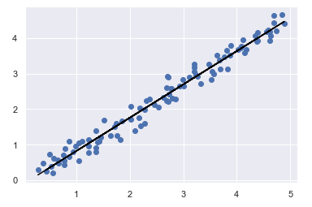

# Linear Regression Simulation with OpenCV Matplotlib

A simple interactive simulation of Linear Regression. It plots data by the pixel number in the OpenCV window. In short, this project is a merge of OpenCV paint program and matplotlib plotting.

## How to use


You'll see an OpenCV window after running the program.


Click to plot data



Press 'esc' to close the OpenCV window.
Finally, you will get a scatter plot of the plotted data and the predicted line of the data on the matplotlib graph.

## How it works

First, I made an OpenCV paint program which basically creates a small point or a circle after a left click of the mouse. After the click, it also adds the coordinate into a list called "data_list". The tricky part here is, OpenCV pixel coordinate and Matplotlib coordinate are not the same. To get the similar plotted data, I had to reverse the 'y' coordinate from the OpenCV window. 

```python
if event == cv2.EVENT_LBUTTONDOWN:
        cv2.circle(img,(x,y),3,(256,0,0),-1)
        x=x/100
        y=(512-y)/100
        data_list.append((x,y))
```

To give the OpenCV window a graphical look, I drew some lines on the window using 'cv2.line'.
As the window is 512 * 512 pixels in size, to create lines of equal sizes I used a condition in the for loop which says "i%32==0". Therefore, it creates the lines properly.

```python
cv2.imshow('Draw',img)
cv2.line(img,pt1=(0,0),pt2=(0,512),color=(0,0,256),thickness=10)
cv2.line(img,pt1=(0,512),pt2=(512,512),color=(0,0,256),thickness=10)
for i in range(512):
    if i%32==0:
        cv2.line(img,pt1=(i,0),pt2=(i,512),color=(0,0,256),thickness=1)
        cv2.line(img,pt1=(0,i),pt2=(512,i),color=(0,0,256),thickness=1)
```

After that  I created a data frame from the list called 'data_list'.
Then the program predicts the line using Linear Regression algorithm.

```python
b = 0
w = 1.5

epochs =1000
learning_rate=0.01

for epoch in range(epochs):
    y_predicted = b+ w*X
    error=y-y_predicted
    L2 = 0.5*np.mean(error**2)
    
    gradient_b= -np.mean(error)
    b=b-learning_rate*gradient_b
    gradient_w= -np.mean(error*X)
    w=w-learning_rate*gradient_w
```
Finally, I used matplotlib's '.scatter' and '.plot' to get the final result.

```python
plt.scatter(X,y)
plt.plot(X,y_predicted,color='black')
plt.show()
```
